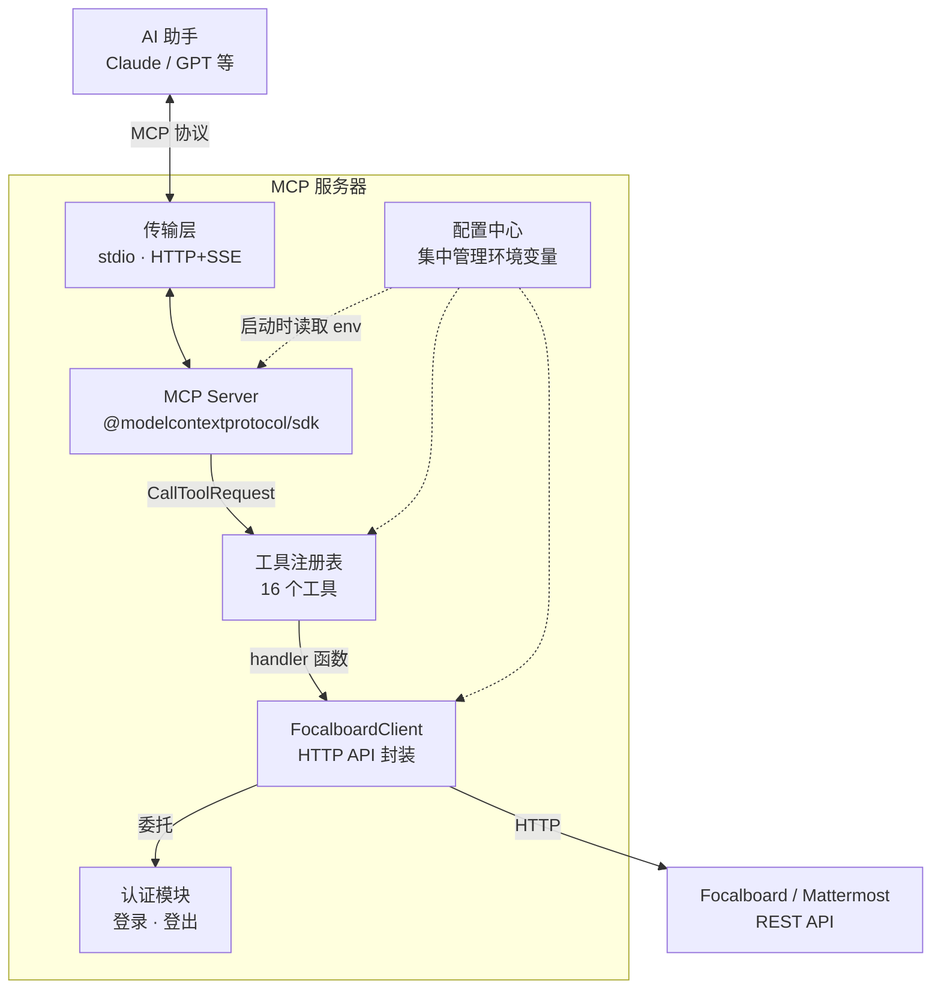
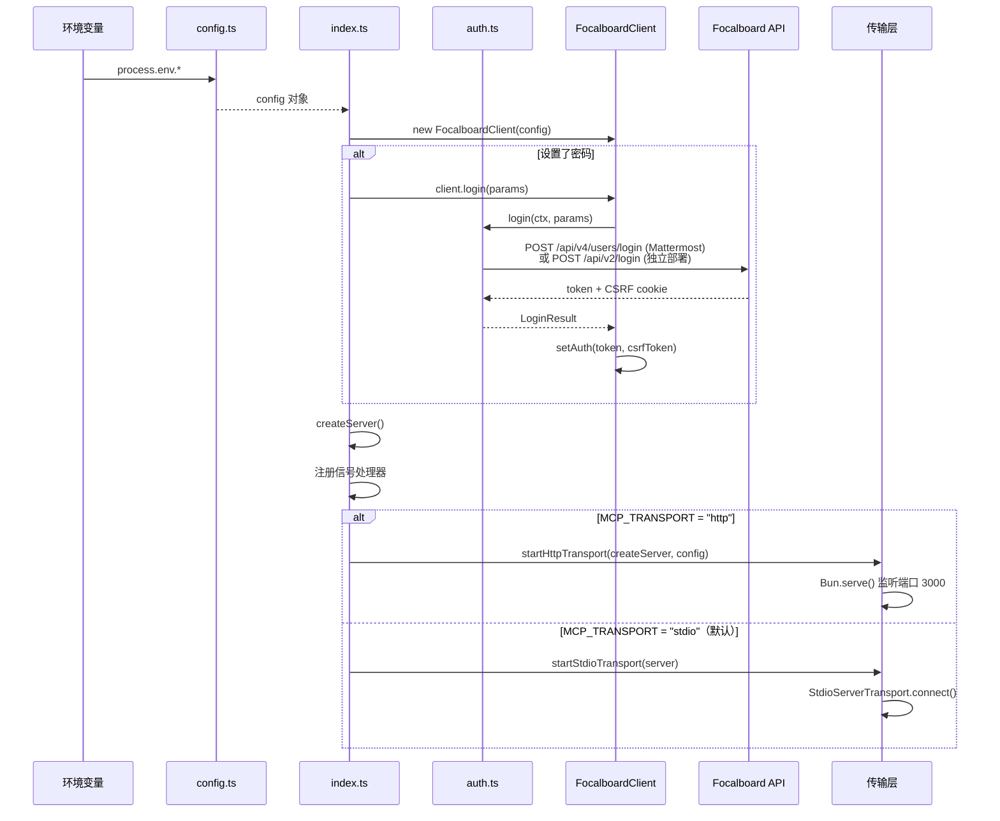
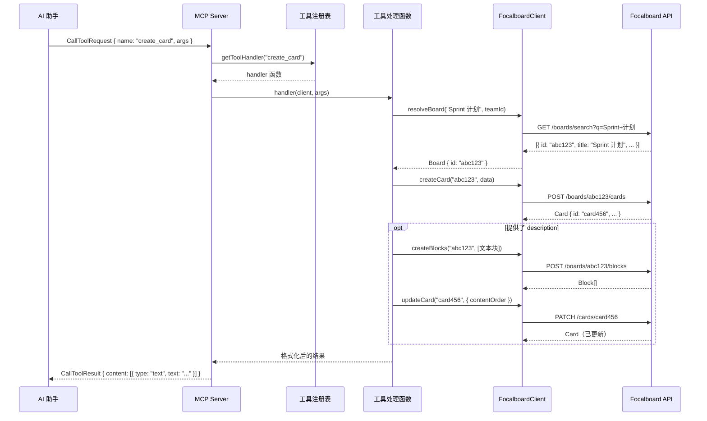
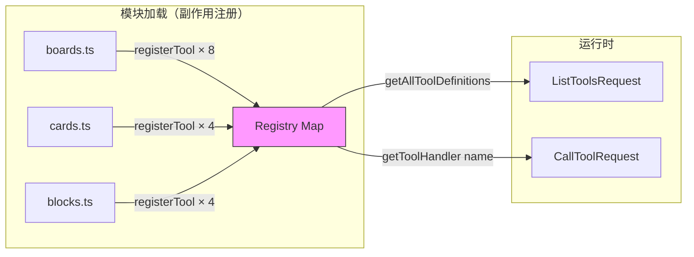
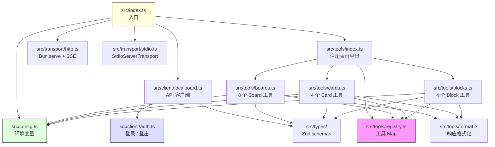
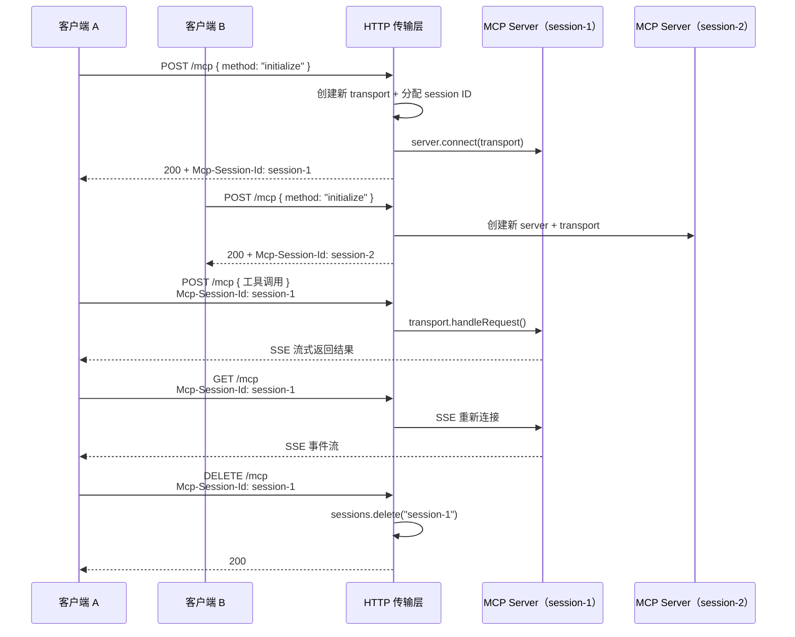
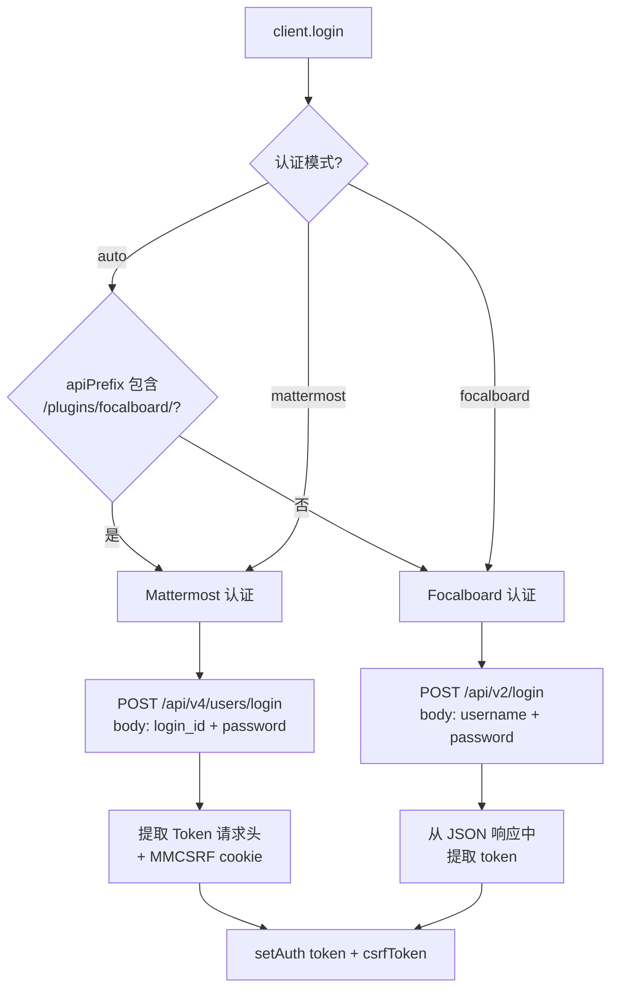

# Focalboard MCP Server

一个基于 [Model Context Protocol](https://modelcontextprotocol.io) 的 [Focalboard](https://www.focalboard.com) / Mattermost Boards 服务器，为 AI 助手提供与看板、卡片和块完整交互的能力。

## 功能特性

- **Board 管理** — 创建、读取、更新、删除、搜索、列表（teamId 自动从环境变量获取）
- **Card 管理** — 列表、获取、创建（支持内联描述）、增量属性更新
- **Block 管理** — 文本、图片、视图等所有块类型的 CRUD 操作
- **成员与用户** — 列出看板成员和团队用户
- **双传输模式** — 支持 Stdio 和 HTTP Streamable 两种 MCP 传输方式
- **灵活认证** — Token 直接认证 或 用户名/密码自动登录（支持 Mattermost）

## 技术栈

| 组件 | 版本 |
|------|------|
| [Bun](https://bun.sh) | v1.3.5+ |
| [MCP SDK](https://github.com/modelcontextprotocol/typescript-sdk) | v1.25.3 |
| [Zod](https://zod.dev) | v4.3.6 |
| TypeScript | 5+ |

## 架构

### 整体架构



### 启动流程



### 工具调用请求流程



### 工具注册表模式



### 模块依赖关系



### HTTP 传输会话管理



### 认证模式



## 安装

```bash
git clone https://github.com/p3psi-boo/focalboard-mcp.git
cd focalboard-mcp
bun install
```

## 快速开始

### Stdio 模式（默认）

```bash
bun run index.ts
```

### HTTP Streamable 模式

```bash
MCP_TRANSPORT=http bun run index.ts
```

服务器默认监听 `http://localhost:3000/mcp`。

## 环境变量

### Focalboard 连接

| 变量 | 说明 | 默认值 |
|------|------|--------|
| `FOCALBOARD_URL` | Focalboard 实例地址 | `http://localhost:8000` |
| `FOCALBOARD_API_PREFIX` | API 路径前缀 | `/api/v2` |
| `FOCALBOARD_TEAM_ID` | 默认团队 ID（用于 list/create） | `0` |
| `FOCALBOARD_TOKEN` | 认证 Token | — |
| `FOCALBOARD_CSRF_TOKEN` | CSRF Token（一般不需要手动设置） | — |
| `FOCALBOARD_REQUESTED_WITH` | `X-Requested-With` 请求头 | `XMLHttpRequest` |

### 自动登录（可选）

设置密码后服务器启动时自动登录，退出时自动登出。

| 变量 | 说明 |
|------|------|
| `FOCALBOARD_PASSWORD` | 登录密码 |
| `FOCALBOARD_LOGIN_ID` | Mattermost 登录 ID |
| `FOCALBOARD_USERNAME` | Focalboard 用户名 |
| `FOCALBOARD_AUTH_MODE` | 认证模式：`auto`（默认）/ `mattermost` / `focalboard` |

> `FOCALBOARD_PASSWORD` 必须与 `FOCALBOARD_LOGIN_ID` 或 `FOCALBOARD_USERNAME` 之一配合使用。

### 传输模式

| 变量 | 说明 | 默认值 |
|------|------|--------|
| `MCP_TRANSPORT` | 传输模式：`stdio` / `http` | `stdio` |
| `MCP_HTTP_PORT` | HTTP 模式监听端口 | `3000` |
| `MCP_HTTP_PATH` | HTTP 模式端点路径 | `/mcp` |

## MCP 客户端配置

### Claude Desktop（Stdio 模式）

`~/Library/Application Support/Claude/claude_desktop_config.json`:

**独立部署 Focalboard：**

```json
{
  "mcpServers": {
    "focalboard": {
      "command": "bun",
      "args": ["/path/to/focalboard-mcp/index.ts"],
      "env": {
        "FOCALBOARD_URL": "https://your-focalboard-instance.com",
        "FOCALBOARD_TOKEN": "your-auth-token"
      }
    }
  }
}
```

**Focalboard 作为 Mattermost 插件：**

```json
{
  "mcpServers": {
    "focalboard": {
      "command": "bun",
      "args": ["/path/to/focalboard-mcp/index.ts"],
      "env": {
        "FOCALBOARD_URL": "https://your-mattermost-instance.com",
        "FOCALBOARD_API_PREFIX": "/plugins/focalboard/api/v2",
        "FOCALBOARD_TOKEN": "your-auth-token",
        "FOCALBOARD_REQUESTED_WITH": "XMLHttpRequest"
      }
    }
  }
}
```

### Claude Code

`~/.claude/settings.json` 或项目 `.mcp.json`：

**独立部署 Focalboard：**

```json
{
  "mcpServers": {
    "focalboard": {
      "command": "bun",
      "args": ["/path/to/focalboard-mcp/index.ts"],
      "env": {
        "FOCALBOARD_URL": "https://your-focalboard-instance.com",
        "FOCALBOARD_TOKEN": "your-auth-token"
      }
    }
  }
}
```

**Focalboard 作为 Mattermost 插件：**

```json
{
  "mcpServers": {
    "focalboard": {
      "command": "bun",
      "args": ["/path/to/focalboard-mcp/index.ts"],
      "env": {
        "FOCALBOARD_URL": "https://your-mattermost-instance.com",
        "FOCALBOARD_API_PREFIX": "/plugins/focalboard/api/v2",
        "FOCALBOARD_TOKEN": "your-auth-token",
        "FOCALBOARD_REQUESTED_WITH": "XMLHttpRequest"
      }
    }
  }
}
```

> **提示：** 当 Focalboard 作为 Mattermost 插件运行时，`FOCALBOARD_API_PREFIX` 必须设为 `/plugins/focalboard/api/v2`。`FOCALBOARD_REQUESTED_WITH` 设为 `XMLHttpRequest` 是 Mattermost CSRF 保护所需。如需自动登录，可用 `FOCALBOARD_LOGIN_ID` + `FOCALBOARD_PASSWORD` 替代 `FOCALBOARD_TOKEN`。

### HTTP Streamable 模式

启动服务器后，将 MCP 客户端指向 `http://localhost:3000/mcp`（或你自定义的地址）。

HTTP 模式支持：
- 有状态会话管理（自动分配 Session ID）
- SSE 流式传输
- 多客户端并发连接
- `DELETE` 请求清理会话

## 可用工具

> 所有参数均使用**名称**而非 ID。服务器会自动按名称搜索解析为 ID。返回结果仅包含关键字段以节省 Token。

### Board 管理（8 个）

| 工具 | 必填参数 | 说明 |
|------|----------|------|
| `create_board` | `title` | 创建新看板 |
| `get_board` | `board` | 按名称或 ID 获取看板详情 |
| `update_board` | `board`, `patch` | 更新看板属性 |
| `delete_board` | `board` | 删除看板 |
| `list_boards` | _(无)_ | 列出所有看板（可选 `query` 按标题搜索） |
| `search_boards` | `query` | 跨团队搜索看板 |
| `get_board_members` | `board` | 列出看板成员 |
| `list_team_users` | _(无)_ | 列出团队中的所有用户 |

### Card 管理（4 个）

| 工具 | 必填参数 | 说明 |
|------|----------|------|
| `list_cards` | `board` | 分页列出卡片（`page`、`per_page`） |
| `get_card` | `card` | 获取单个卡片及其所有属性 |
| `create_card` | `board` | 创建卡片，支持属性和可选 `description`（自动创建文本块 + 设置 contentOrder） |
| `update_card` | `card`, `patch` | 更新卡片标题、图标或属性（增量合并） |

### Block 管理（4 个）

| 工具 | 必填参数 | 说明 |
|------|----------|------|
| `create_block` | `board`, `type` | 创建块（text、image、card、view、divider、checkbox、h1-h3 等） |
| `get_blocks` | `board` | 获取看板中的块（可选 `type` 和 `parent` 过滤） |
| `update_block` | `board`, `block`, `patch` | 更新块 |
| `delete_block` | `board`, `block` | 删除块 |

## 使用示例

```
创建一个名为"Sprint 计划"的新看板
```

```
在"Sprint 计划"看板中创建一个卡片，标题"设计 API 接口"，描述"定义新服务的 REST 端点和请求/响应模型"
```

```
列出"Sprint 计划"看板中的所有卡片
```

```
更新"设计 API 接口"卡片，将状态设为"进行中"
```

## 项目结构

```
focalboard-mcp/
├── index.ts                  # 入口（re-export）
├── src/
│   ├── index.ts              # 服务器启动、认证引导、传输选择
│   ├── config.ts             # 集中式环境变量配置
│   ├── client/
│   │   ├── focalboard.ts     # Focalboard HTTP API 客户端（CRUD + 名称解析）
│   │   └── auth.ts           # 认证模块（登录/登出、cookie 解析）
│   ├── tools/
│   │   ├── registry.ts       # 工具注册表（基于 Map 的 registerTool 模式）
│   │   ├── boards.ts         # 8 个 Board 工具（导入时注册）
│   │   ├── cards.ts          # 4 个 Card 工具（导入时注册）
│   │   ├── blocks.ts         # 4 个 Block 工具（导入时注册）
│   │   ├── format.ts         # 响应格式化工具
│   │   └── index.ts          # 副作用导入 + 注册表再导出
│   ├── transport/
│   │   ├── http.ts           # HTTP Streamable 传输（Bun.serve + SSE）
│   │   └── stdio.ts          # Stdio 传输封装
│   └── types/
│       ├── board.ts          # Board Zod schemas
│       ├── card.ts           # Card Zod schemas
│       ├── block.ts          # Block Zod schemas
│       ├── common.ts         # 共享类型（FocalboardConfig、PropertyOption 等）
│       └── index.ts          # 类型再导出
├── test/                     # 测试文件
├── swagger.yml               # Focalboard API 规范
├── package.json
└── tsconfig.json
```

## 开发

```bash
# 热重载开发
bun --hot index.ts

# 运行测试
bun test

# 监听模式测试
bun test --watch

# 测试覆盖率
bun test --coverage
```

## 许可证

MIT
