# Focalboard MCP Server

A [Model Context Protocol](https://modelcontextprotocol.io) server for [Focalboard](https://www.focalboard.com) / Mattermost Boards, giving AI assistants full access to boards, cards, and blocks.

## Features

- **Board management** — create, read, update, delete, search, list (team ID auto-loaded from env)
- **Card management** — list, get, create (with inline description), update with property merging
- **Block management** — CRUD for text, images, views, and all other block types
- **Member & user tools** — list board members and team users
- **Dual transport** — Stdio and HTTP Streamable MCP transports
- **Flexible auth** — direct token, or username/password auto-login (supports Mattermost)

## Tech Stack

| Component | Version |
|-----------|---------|
| [Bun](https://bun.sh) | v1.3.5+ |
| [MCP SDK](https://github.com/modelcontextprotocol/typescript-sdk) | v1.25.3 |
| [Zod](https://zod.dev) | v4.3.6 |
| TypeScript | 5+ |

## Architecture

### High-Level Overview


### Startup Sequence

```mermaid
sequenceDiagram
    participant Env as Environment
    participant Config as config.ts
    participant Index as index.ts
    participant Auth as auth.ts
    participant Client as FocalboardClient
    participant FB as Focalboard API
    participant Transport as Transport Layer

    Env->>Config: process.env.*
    Config-->>Index: config object

    Index->>Client: new FocalboardClient(config)

    alt password is set
        Index->>Client: client.login(params)
        Client->>Auth: login(ctx, params)
        Auth->>FB: POST /api/v4/users/login (Mattermost)<br>or POST /api/v2/login (standalone)
        FB-->>Auth: token + CSRF cookie
        Auth-->>Client: LoginResult
        Client->>Client: setAuth(token, csrfToken)
    end

    Index->>Index: createServer()
    Index->>Index: register signal handlers

    alt MCP_TRANSPORT = "http"
        Index->>Transport: startHttpTransport(createServer, config)
        Transport->>Transport: Bun.serve() on port 3000
    else MCP_TRANSPORT = "stdio" (default)
        Index->>Transport: startStdioTransport(server)
        Transport->>Transport: StdioServerTransport.connect()
    end
```



### Tool Call Request Flow


### Tool Registry Pattern


### Module Dependency Graph


### HTTP Transport Session Management


### Authentication Modes


## Installation

```bash
git clone https://github.com/p3psi-boo/focalboard-mcp.git
cd focalboard-mcp
bun install
```

## Quick Start

### Stdio mode (default)

```bash
bun run index.ts
```

### HTTP Streamable mode

```bash
MCP_TRANSPORT=http bun run index.ts
```

Server listens on `http://localhost:3000/mcp` by default.

## Environment Variables

### Focalboard Connection

| Variable | Description | Default |
|----------|-------------|---------|
| `FOCALBOARD_URL` | Focalboard instance URL | `http://localhost:8000` |
| `FOCALBOARD_API_PREFIX` | API path prefix | `/api/v2` |
| `FOCALBOARD_TEAM_ID` | Default team ID (for list/create) | `0` |
| `FOCALBOARD_TOKEN` | Auth token | — |
| `FOCALBOARD_CSRF_TOKEN` | CSRF token (usually not needed manually) | — |
| `FOCALBOARD_REQUESTED_WITH` | `X-Requested-With` header | `XMLHttpRequest` |

### Auto-login (optional)

When a password is set, the server logs in at startup and logs out on exit.

| Variable | Description |
|----------|-------------|
| `FOCALBOARD_PASSWORD` | Login password |
| `FOCALBOARD_LOGIN_ID` | Mattermost login ID |
| `FOCALBOARD_USERNAME` | Focalboard username |
| `FOCALBOARD_AUTH_MODE` | Auth mode: `auto` (default) / `mattermost` / `focalboard` |

> `FOCALBOARD_PASSWORD` must be paired with either `FOCALBOARD_LOGIN_ID` or `FOCALBOARD_USERNAME`.

### Transport

| Variable | Description | Default |
|----------|-------------|---------|
| `MCP_TRANSPORT` | Transport mode: `stdio` / `http` | `stdio` |
| `MCP_HTTP_PORT` | HTTP mode listen port | `3000` |
| `MCP_HTTP_PATH` | HTTP mode endpoint path | `/mcp` |

## MCP Client Configuration

### Claude Desktop (Stdio mode)

`~/Library/Application Support/Claude/claude_desktop_config.json`:

**Standalone Focalboard:**

```json
{
  "mcpServers": {
    "focalboard": {
      "command": "bun",
      "args": ["/path/to/focalboard-mcp/index.ts"],
      "env": {
        "FOCALBOARD_URL": "https://your-focalboard-instance.com",
        "FOCALBOARD_TOKEN": "your-auth-token"
      }
    }
  }
}
```

**Focalboard as Mattermost plugin:**

```json
{
  "mcpServers": {
    "focalboard": {
      "command": "bun",
      "args": ["/path/to/focalboard-mcp/index.ts"],
      "env": {
        "FOCALBOARD_URL": "https://your-mattermost-instance.com",
        "FOCALBOARD_API_PREFIX": "/plugins/focalboard/api/v2",
        "FOCALBOARD_TOKEN": "your-auth-token",
        "FOCALBOARD_REQUESTED_WITH": "XMLHttpRequest"
      }
    }
  }
}
```

### Claude Code

`~/.claude/settings.json` or project `.mcp.json`:

**Standalone Focalboard:**

```json
{
  "mcpServers": {
    "focalboard": {
      "command": "bun",
      "args": ["/path/to/focalboard-mcp/index.ts"],
      "env": {
        "FOCALBOARD_URL": "https://your-focalboard-instance.com",
        "FOCALBOARD_TOKEN": "your-auth-token"
      }
    }
  }
}
```

**Focalboard as Mattermost plugin:**

```json
{
  "mcpServers": {
    "focalboard": {
      "command": "bun",
      "args": ["/path/to/focalboard-mcp/index.ts"],
      "env": {
        "FOCALBOARD_URL": "https://your-mattermost-instance.com",
        "FOCALBOARD_API_PREFIX": "/plugins/focalboard/api/v2",
        "FOCALBOARD_TOKEN": "your-auth-token",
        "FOCALBOARD_REQUESTED_WITH": "XMLHttpRequest"
      }
    }
  }
}
```

> **Tip:** When running Focalboard as a Mattermost plugin, `FOCALBOARD_API_PREFIX` must be set to `/plugins/focalboard/api/v2`. `FOCALBOARD_REQUESTED_WITH` set to `XMLHttpRequest` is required by Mattermost's CSRF protection. For auto-login, you can use `FOCALBOARD_LOGIN_ID` + `FOCALBOARD_PASSWORD` instead of `FOCALBOARD_TOKEN`.

### HTTP Streamable mode

Start the server, then point your MCP client to `http://localhost:3000/mcp` (or your custom address).

HTTP mode supports:
- Stateful session management (auto-assigned Session ID)
- SSE streaming
- Concurrent multi-client connections
- `DELETE` request to clean up sessions

## Available Tools

> All parameters accept **names** instead of IDs. The server resolves names to IDs automatically. Responses include only essential fields to save tokens.

### Board Tools (8)

| Tool | Required params | Description |
|------|----------------|-------------|
| `create_board` | `title` | Create a new board |
| `get_board` | `board` | Get board details by name or ID |
| `update_board` | `board`, `patch` | Update board properties |
| `delete_board` | `board` | Delete a board |
| `list_boards` | _(none)_ | List all boards (optional `query` to search by title) |
| `search_boards` | `query` | Search boards across all teams |
| `get_board_members` | `board` | List members of a board |
| `list_team_users` | _(none)_ | List all users in a team |

### Card Tools (4)

| Tool | Required params | Description |
|------|----------------|-------------|
| `list_cards` | `board` | List cards with pagination (`page`, `per_page`) |
| `get_card` | `card` | Get a single card with all properties |
| `create_card` | `board` | Create a card with properties and optional `description` (auto-creates text block + contentOrder) |
| `update_card` | `card`, `patch` | Update card title, icon, or properties (merges incrementally) |

### Block Tools (4)

| Tool | Required params | Description |
|------|----------------|-------------|
| `create_block` | `board`, `type` | Create a block (text, image, card, view, divider, checkbox, h1-h3, etc.) |
| `get_blocks` | `board` | Get blocks from a board (optional `type` and `parent` filters) |
| `update_block` | `board`, `block`, `patch` | Update a block |
| `delete_block` | `board`, `block` | Delete a block |

## Usage Examples

```
Create a new board called "Sprint Planning"
```

```
Create a card on "Sprint Planning" with title "Design API schema" and description "Define the REST endpoints and request/response models for the new service"
```

```
List all cards on the "Sprint Planning" board
```

```
Update the card "Design API schema" — set status to "In Progress"
```

## Project Structure

```
focalboard-mcp/
├── index.ts                  # Entry point (re-export)
├── src/
│   ├── index.ts              # Server startup, auth bootstrap, transport selection
│   ├── config.ts             # Centralized environment variable config
│   ├── client/
│   │   ├── focalboard.ts     # Focalboard HTTP API client (CRUD + resolution)
│   │   └── auth.ts           # Authentication (login/logout, cookie parsing)
│   ├── tools/
│   │   ├── registry.ts       # Tool registry (Map-based registerTool pattern)
│   │   ├── boards.ts         # 8 board tools (registered at import)
│   │   ├── cards.ts          # 4 card tools (registered at import)
│   │   ├── blocks.ts         # 4 block tools (registered at import)
│   │   ├── format.ts         # Response formatting utilities
│   │   └── index.ts          # Side-effect imports + registry re-exports
│   ├── transport/
│   │   ├── http.ts           # HTTP Streamable transport (Bun.serve + SSE)
│   │   └── stdio.ts          # Stdio transport wrapper
│   └── types/
│       ├── board.ts          # Board Zod schemas
│       ├── card.ts           # Card Zod schemas
│       ├── block.ts          # Block Zod schemas
│       ├── common.ts         # Shared types (FocalboardConfig, PropertyOption, etc.)
│       └── index.ts          # Type re-exports
├── test/                     # Test files
├── swagger.yml               # Focalboard API specification
├── package.json
└── tsconfig.json
```

## Development

```bash
# Hot-reload development
bun --hot index.ts

# Run tests
bun test

# Watch mode tests
bun test --watch

# Test coverage
bun test --coverage
```

## License

MIT
